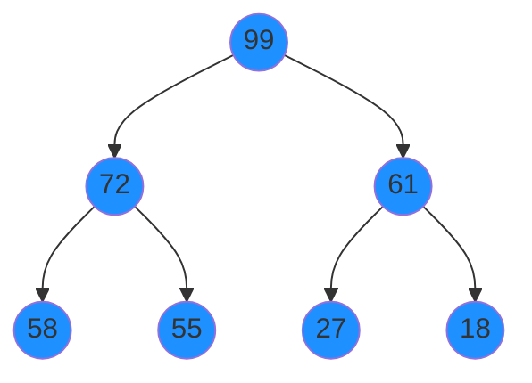
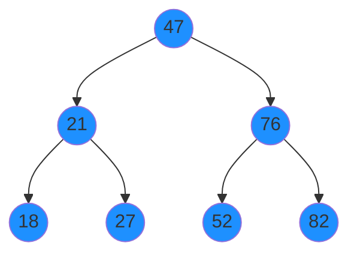

## CPP-DSA-Udemy-Course

Notes from the Udemy course - [C++ Data Structures & Algorithms + LEETCODE Exercises](https://www.udemy.com/course/data-structures-algorithms-cpp/learn/lecture)

## Section 3: Big 0

Omega (Ω) - Lower Bound
- Describes the best-case scenario for an algorithm.
Theta (Θ) - Tight Bound 
- Tells you what to generally expect in terms of time complexity. 
Omicron - Big O (O) - Upper Bound (Worst Case)
- It tells you the slowest an algorithm can run in the worst circumstances.

O(n^2) - Loop within a loop
O(n) - Proportional
O(log n) - Divide and conquer
O(1) - Constant

https://www.bigocheatsheet.com/

## Section 16: Hash Tables

Collisions can be handled by
1. Separate Chaining - storing multiple values per key
1. Linear Probing, a form of open addressing - storing KVP in next available index

## Section 21: Heaps

Heap: A binary search tree, where the tree is always _complete_ and can contain duplicates. Child nodes are not ordered.

Max heap: Each node has a value that is greater than or equal to its descendants.

Min heap: Each node has a value that is less than or equal to its descendants.

A heap is implemented with a vector, without a node class.



This would be stored as a vector, either indexed from 0 or 1.

`| 99 | 72 | 61 | 58 | 55 | 27 | 18 |`

Assuming elements are _indexed from 1_, i.e. index 0 is left empty, to find the children of a node;

```
leftChild = 2 * parentIndex
rightChild = 2 * parentIndex + 1
```

To find the parent of a node, works for right and left child, truncating to int;
```
parent = childIndex / 2
```

Assuming elements are _indexed from 0_, to find the children of a node;

```
leftChild = 2 * parentIndex + 1
rightChild = 2 * parentIndex + 2
```

To find the parent of a node, works for right and left child, truncating to int;
```
parent = childIndex - 1 / 2
```

### Inserting a node
Node is always inserted at the bottom to keep the tree complete. Then find the correct position by swapping it with it's parent until the parent is larger, or the top of the tree is reached.


## Section 26: Tree Traversal




BFS output;

`47 21 76 18 27 52 82`

DFS Pre-order traversal output;

`47 21 18 27 76 52 82`

DFS Post-order traversal output;

`18 27 21 52 82 76 47`

DFS In-order traversal output;

`18 21 27 47 52 76 82`